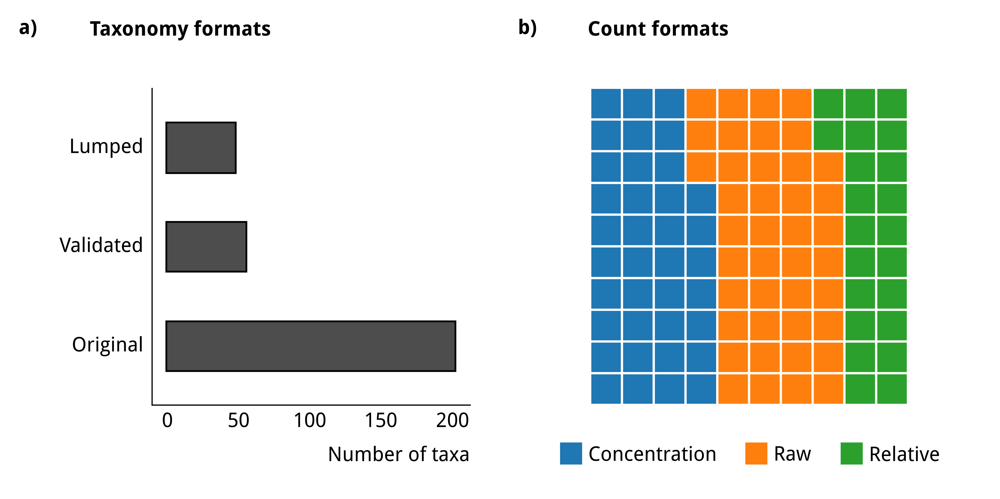

# Summary

`forcis` is an R package designed to streamline access to the recently published
FORCIS (Foraminifera Response to Climatic Stress) database [@chaabane2023]. This 
package enables users to easily download the database directly into an R 
environment, filter and select relevant data, convert species counts across 
formats, and visualise the results.


# Statement of need

The recently developed FORCIS (Foraminifera Response to Climatic Stress) 
database provides one of the most comprehensive collections of global planktonic 
foraminifera living census data, comprising over 163,000 samples collected via 
various sampling devices (Continuous Plankton Recorder — CPR —, plankton nets, 
pumps, and sediment traps). These samples span a wide temporal range (1910 to 
2018), vertical depths (surface to 5,000 m), and spatial coverage 
[@chaabane2023; @degaridel2022]. FORCIS data are crucial 
for advancing insights into potential spatial and vertical migrations and 
understanding the impacts of global climate change on planktonic foraminifera 
biogeography and their seasonal and vertical distribution patterns observed in 
recent decades. Additionally, FORCIS’s long temporal scope offers a valuable 
resource for investigating the influence of anthropogenic changes on planktonic 
foraminifera distribution and ecology [@chaabane2024].

However, working with the FORCIS database presents significant challenges due 
to the heterogeneity of the data, which has been compiled from 140 sources, 
each using its own taxonomic framework and reporting formats (\autoref{fig:fig1}). This 
results in variability in data units, such as concentrations, frequencies, and 
raw counts, requiring extensive standardisation for meaningful comparison. 
Furthermore, the metadata associated with each sample — such as location, 
sampling depth, time, and environmental parameters — adds another layer of 
complexity, making data extraction and analysis challenging for users.

{ width=100% }


To overcome these obstacles, we developed the `forcis` package, an easy-to-use 
tool made especially for using the R programming environment to access, filter, 
harmonise, and visualise the FORCIS data. The `forcis` package enables users to 
download data directly from [Zenodo](https://doi.org/10.5281/zenodo.7390791) the 
latest version of the FORCIS database, 
filter and select data according to user-specified criteria, harmonise 
taxonomic resolution, convert species counts into uniform units, and visualise 
patterns in diversity and abundance. By combining these features, the package 
enables researchers to access and analyse the data within the FORCIS database 
efficiently, streamlining their investigative efforts. 


# Main features

To facilitate efficient management and analysis of the FORCIS database, the 
`forcis` R package provides a comprehensive set of features fully described in 
the [package vignettes](https://docs.ropensci.org/forcis/articles/), where users can find extensive documentation and 
tutorials on the major features of the package. The recommended workflow and 
the relevant main functions are illustrated in \autoref{fig:fig2}.

{ width=100% }


## Download and import FORCIS database in R

The `forcis` R package contains functions that simplify downloading and 
importing FORCIS datasets from [Zenodo](https://doi.org/10.5281/zenodo.7390791). 
The FORCIS database's most recent version can be retrieved using the function 
`download_forcis_db()`. 


```r
# Create a data/ directory in the current directory ----
dir.create("data")

# Download the latest version of the FORCIS database ----
download_forcis_db(path = "data", timeout = 300)
```


The `read_*_data()` function family helps users in importing dataset specific 
to a particular sampling device, enabling focused analyses.


```r
# Import plankton nets data (previously downloaded) ----
net_data <- read_plankton_nets_data(path = "data")
```


Once the data is imported in R, users can reduce the dataset to include only 
the metadata they are interested in by using the function 
`select_forcis_columns()`.


## Harmonising taxonomy

To utilise most features of the `forcis` R package, users need to specify the 
taxonomic framework they wish to apply (\autoref{fig:fig2}). The FORCIS database includes 
counts at three different taxonomic levels: Original Taxonomy (OT), Lumped 
Taxonomy (LT), and Validated Taxonomy (VT). For a detailed explanation of the 
differences between these three taxonomic levels, we refer the reader to the 
FORCIS data descriptor [@chaabane2023]. For selecting the taxonomic 
framework of choice, the users can use the function `select_taxonomy()` 
following the example below:


```r
# Select a taxonomic framework ----
net_data_vt <- net_data |>
  select_taxonomy(taxonomy = "VT")
```

## Filter data

After selecting the taxonomic framework, the `forcis` R package offers multiple 
functions to efficiently subset the FORCIS datasets. Users may be interested in 
analysing community structure at a specific time, or location, or even 
examining the counts of species of interest. Given the wide range of potential 
research questions, we have implemented six filtering functions within the 
`filter_by_*()` function family, allowing users to customise data extraction 
according to their investigation needs (\autoref{fig:fig2}).


```r
# Filter data by year(s) ----
net_data_sub <- net_data_vt |>
  filter_by_year(years = 1992)

# Filter data by spatial bounding box ----
net_data_sub <- net_data_vt |>
  filter_by_bbox(bbox = c(45, -61, 82, -24))

# Filter data by ocean name ----
net_data_sub <- net_data_vt |>
  filter_by_ocean(ocean = "Indian Ocean")

# Filter data by species ----
net_data_sub <- net_data_vt |>
  filter_by_species(species = "n_pachyderma_VT")
```


## Transform data

The `compute_*()` function family allows users to convert FORCIS data between 
raw abundance, number concentration, and relative abundance, enabling them to 
use the units that best suit their analyses and facilitating comparison between 
the FORCIS data and their own.
These functions utilise sample metadata to perform unit conversions. 
Specifically, conversions between raw abundance and number concentration in 
the `forcis` R package are calculated for each taxon using the following 
equations:

$$C_{number} = \frac{N_{raw}}{V_{filtered}}$$

where $C_{number}$ is the number concentration, $N_{raw}$ is the raw abundance 
(count of individuals), and $V_{filtered}$ is the volume of water filtered 
(in $m^3$ or L, depending on the dataset).

$$Frequency = 100 \cdot \frac{N_{raw}}{N_{total}}$$

where $Frequency$ is the relative abundance (in percentage), $N_{raw}$ is the 
raw abundance (count of individuals) of a given taxon, and $N_{total}$ is the 
total raw abundance (sum of all individuals in the sample or subsample).

The users can decide whether to convert counts at a sample or subsample level 
(see @chaabane2023) as the `compute_*()` functions propose the 
`aggregate` argument. If `aggregate = TRUE`, the function will return the 
transformed counts of each species using the sample as the unit. If 
`aggregate = FALSE`, it will re-calculate the species' abundance by subsample. 


## Visualisation

The `forcis` package also includes multiple functions to visualise the spatial 
distribution of samples selected by users. The `ggmap_data()` function 
generates publication-ready maps, displaying sample locations at a global scale 
(\autoref{fig:fig3}a). Additionally, users can visualise sample records by various time 
units (season, month, year) and by depth, using the functions from the 
`plot_record_by_*()` function family (\autoref{fig:fig3}b-d).
These functions can be seamlessly combined with the `filter_by_*()` family of 
functions, allowing users to customise their sample selections according to 
their specific research needs.

{ width=100% }

```r
# Map raw net data ----
ggmap_data(net_data)

# Plot number of records by year of sampling ----
plot_record_by_year(net_data)

# Plot number of records by month of sampling ----
plot_record_by_month(net_data)

# Plot number of records by depth of sampling ----
plot_record_by_depth(net_data)
```


`forcis` provides five vignettes to learn more about the package:

- the [Get started](https://docs.ropensci.org/forcis/articles/forcis.html) 
vignette describes the core features of the package
- the [Database versions](https://docs.ropensci.org/forcis/articles/database-versions.html)
vignette provides information on how to deal with the versioning of the database
- the [Select and filter data](https://docs.ropensci.org/forcis/articles/select-and-filter-data.html) vignette shows examples to handle the FORCIS data
- the [Data conversion](https://docs.ropensci.org/forcis/articles/data-conversion.html) 
vignette describes the conversion functions available in `forcis` to compute abundances, concentrations, and frequencies
- the [Data visualization](https://docs.ropensci.org/forcis/articles/data-visualization.html)
vignette describes the plotting functions available in `forcis`


# Acknowledgements

The FORCIS project is supported by the French Foundation for Biodiversity 
Research ([FRB](https://www.fondationbiodiversite.fr)) through its Centre for 
the Synthesis and Analysis of Biodiversity 
([CESAB](https://www.fondationbiodiversite.fr/en/about-the-foundation/le-cesab/)) 
and co-funded by INSU LEFE program and the Max Planck Institute for Chemistry 
(MPIC) in Mainz. M.G. was supported by a Juan de la Cierva-formacion 2021 
fellowship (FJC2021–047494-I/MCIN/AEI/10.13039/501100011033) from the European 
Union “NextGenerationEU”/PRTR and by the Beatriu de Pinós  programme 
(2022 BP 00209) funded by the Direcció General de Recerca (DGR) del Departament 
de Recerca i Universitats (REU) of the Government of Catalonia. In addition, 
his work received support from the French government under the France 2030 
investment plan, as part of the Initiative d’Excellence d’Aix-Marseille 
Université (A*MIDEX AMX-20-TRA-029). The authors would like to thank Beatriz 
Milz, Scott Chamberlain and Air Forbes for theirs valuable comments during the 
peer review process in 
[rOpenSci](https://github.com/ropensci/software-review/issues/660).


# References
