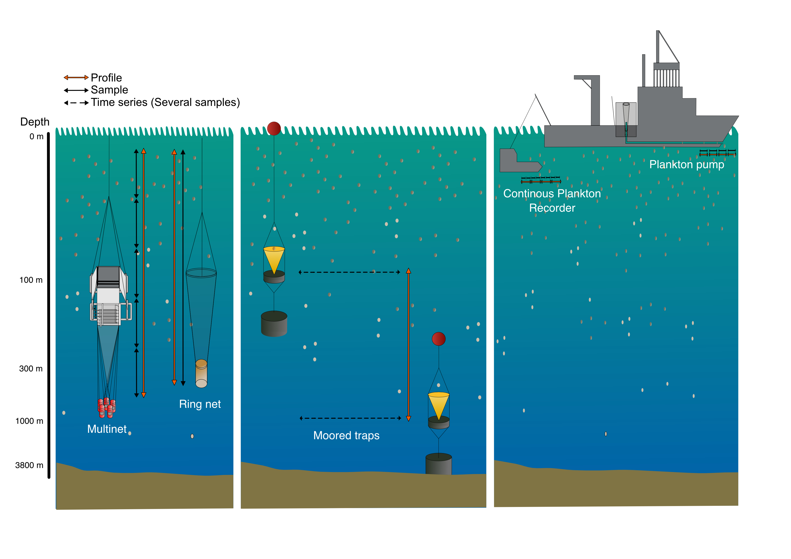

```{r, include = FALSE}
knitr::opts_chunk$set(
  collapse = TRUE,
  eval     = FALSE,
  echo     = TRUE,
  comment  = "#>"
)
```


The [FORCIS](https://zenodo.org/doi/10.5281/zenodo.7390791) (Foraminifera Response to Climatic Stress) database serves as a repository for datasets documenting the diversity and distribution of living planktonic foraminifera in the global oceans spanning from 1910 to 2018. This comprehensive database encompasses data collected through four sampling methods, including: 

-	Plankton net
-	Continuous Plankton Recorder (CPR)
-	Sediment traps
-	Pump




Within the FORCIS database, each subsample is linked through unique identifiers, or primary keys, labeled as `site_id`, `profile_id`, `cast_id`, `sample_id`, and `subsample_id`. These identifiers establish a hierarchical framework, facilitating the exploration and analysis of the data.


## Site identifier

Each site is characterized only by its location (longitude and latitude coordinates). Associated information are water depth and ocean basin.

The unique identifier `site_id` could be either sourced from the original publication/study (e.g. PECH_B), or generated by the database managers (e.g. MedSeaCruise_St1).


## Profile identifier

For the **net data**, profiles are distinguished by their time of collection and location as well. For each profile in this table, `profile_id` is attributed based on the profile date (time of the collection) and coordinates. Overall, profile identifier have the same coordinates, and different times of sampling were incremented. In some cases, the coordinates, profile date and site water depth at the same profile could change slightly due to the multiple sampling events and ship movements (e.g. when multiple sampling events were carried out at the same site). For the **sediment trap data**, the profile identifier is incremented when the deployment has changed. The date, depth range of each profile, availability of the environmental data including ambient seawater chemistry, and profile season are also included in the table profiles.


## Cast identifier

The `cast_id` provides information regarding the casts, the sampling device name, depth range of a cast, mesh size, and net opening of the plankton tow.


## Sample identifier

Each sample is characterized by its depth range, volume of water filtered (for net data), coordinates, segment length (for CPR data), date of sampling, and in situ temperature and salinity.


## Subsample identifier

One sample could be divided into different subsamples (`subsample_id`) based on their `subsample_size_fraction_min`, `subsample_size_fraction_max` or/and `subsample_living_or_dead`. Other information is also reported such as: `subsample_count_type`, `subsample_sieved_or_measured`, `subsample_storage_type`, and `subsample_splitting_type`.


